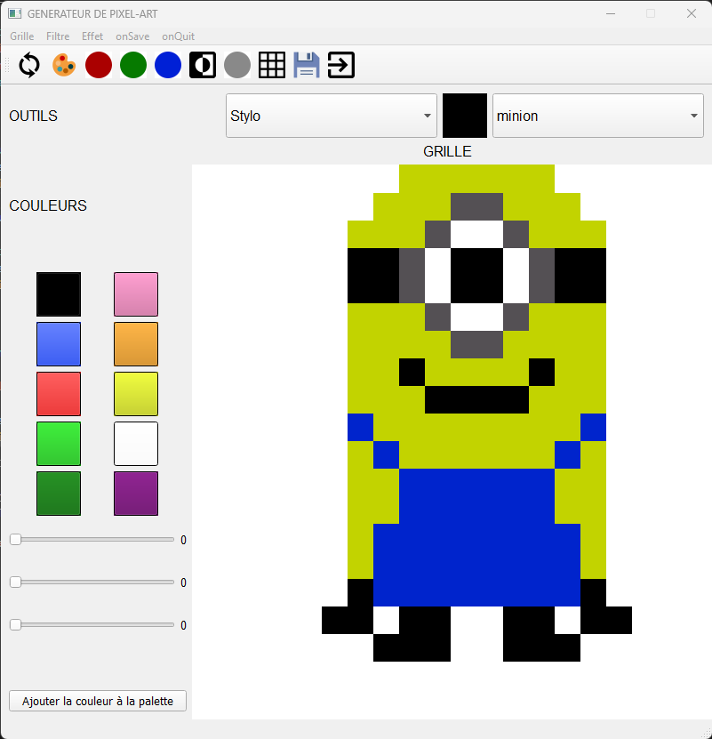

# Pixel Art Generator  

A simple pixel art generator created with PyQt5.

## Features  

Creation of pixel art images  
Use of different tools (pencil, eraser, fill, bucket)  
Selection of custom colors  
Saving and loading of projects  
Application of filters (red, green, blue, negative, grayscale)  
Display of a grid to facilitate creation  

## Usage  

Run the main.py file to launch the application.  
Select a tool from the top toolbar.
Choose a color from the color palette.
Click on the pixels to color them.
Use the filters to modify the appearance of your image.
Save your project by clicking on "Save" in the "File" menu.
Load a saved project by clicking on "Load" in the "File" menu.

## Dependencies  

 - PyQt5
 - PIL (Python Imaging Library)

## Compatibility  

 - Python 3.x
 - Windows, macOS, Linux

## License  

This project is under the MIT License. You can use and modify the code according to the terms of the license.